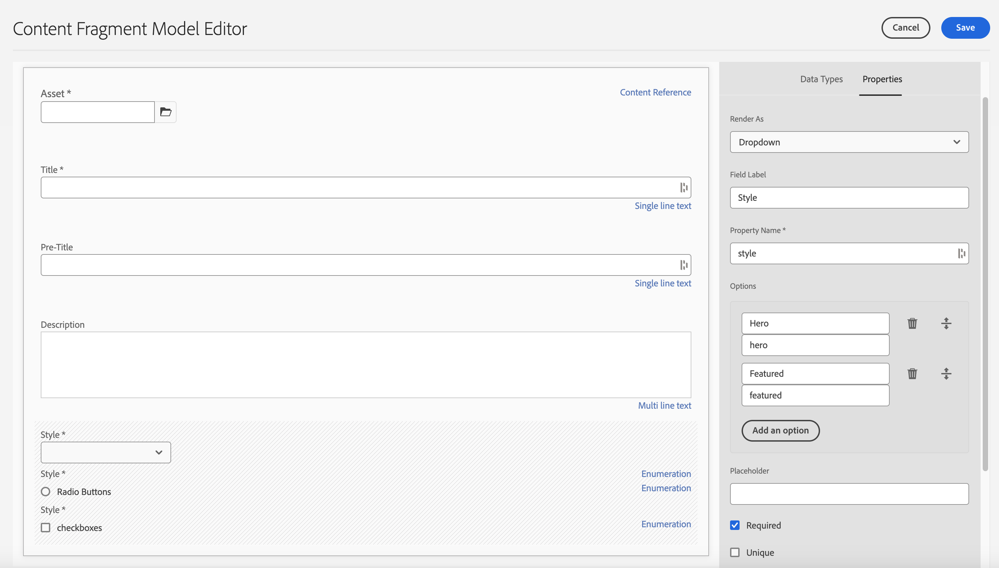
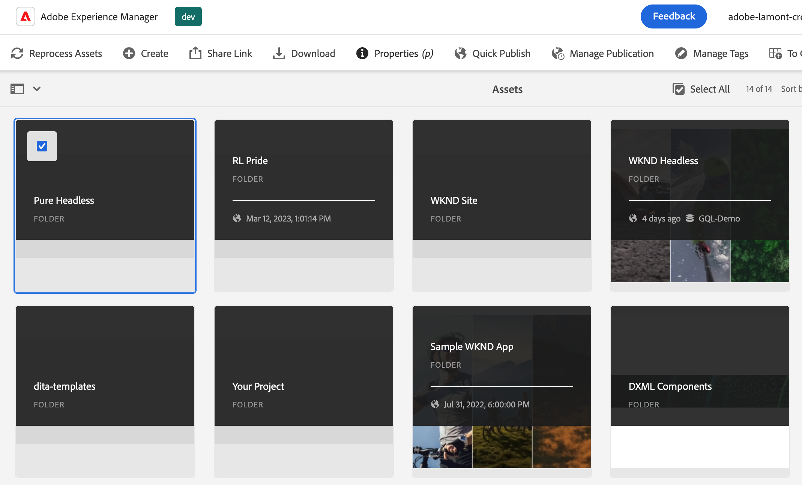

# Building a Pure Headless Site

## Setup Environment

What you need.

- [Node.js v16+](https://nodejs.org/en/)
- [npm 6+](https://www.npmjs.com/)
- [Git](https://git-scm.com/) 

We would advise using NVM to address having multiple versions of node.js on the same machine.

We will be using Visual Studio Code in the lab.  Ensure that you have GitHub Extension installed.

For the session everyone will be creating a site using Google Drive or Sharepoint and Github.  Come to the session with your own Github account.  We would recommend using a personal account.  You may use Google Drive or Sharepoint, however you will need to have the ability to share the folder outside of your organization.  A personal Google Drive account might be the easiest.

Ensure that you have privileges to install libraries globally on your computer during the session.

To validate that you have everything setup correctly, open visual studio code an select "Terminal" from menu bar and select "New Terminal".  Type

`node -v`

If nodel was correctly installed it will print out the version. For NPM, you can type:

`npm -v`

And for git, you can type:

`git -v`

If everything is installed correctly, all of these commands will repond with the version installed.

There is a slack channel available should you need support with setup in advance to the workshop.

[Dev Workshop Slack](https://adobe-dx-support.slack.com/archives/C037U87UYC9/p1665586411118719)

## Build Models

1. Navigate to Tools > Configuration Browswer and we will create a new configuration.

We will give it a title and name and select GraphQL Persisted Queires and Content Fragment Models.

2. Navigate to Tools > Content Fragment Models and click into the folder with the name of the configuration you just created.

3. Inside the folder we will create a new model called Teaser.  Click create and give the model the name "Teaser".  To our teaser model we will give the follow datatypes.

| Datatype | Name | Required | Options |
|----------|------|----------|---------|
| Content Reference | Asset | yes | Add a default image if you'd like.  Ex: /content/dam/wknd-headless/assets/AdobeStock_307513975.mp4 |
| Single line text | Title | yes |
| Single line text | Pre-Title | no |
| Multi line text | Description | no | Ensure default type is rich text |
| Enumeration | Style | yes | Render as dropdown.  Options are Hero -> hero and Featured -> featured |

4. Inside the folder we will create a second new model called Offer.  Click create and give the model the name "Offer".  To our offer model we will give the follow datatypes.

| Datatype | Name | Required | Options |
|----------|------|----------|---------|
| Conent Reference | Asset | yes | Add default image. Ex: /content/dam/wknd-headless/assets/AdobeStock_238607111.jpeg |
| Single line text | Call to Action | yes | |
| Multi line text | Description | no ||

5. Inside the folder we will create a second new model called Image List.  Click create and give the model the name "Image List".  To our imagelist model we will give the follow datatypes.

| Datatype | Name | Required | Options |
|----------|------|----------|---------|
| Fragement Reference | List Items | yes | Render as Multiple Field.  Allowed content fragment model is Offer. |

Select the folder and choose the properties navigation item.

